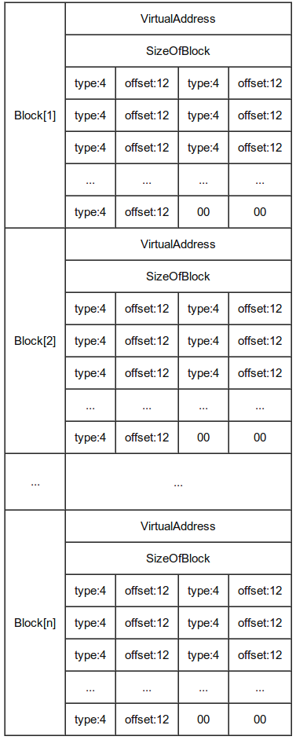

# Executable Formats
[Wikipedia](https://en.wikipedia.org/wiki/Executable_and_Linkable_Format)

## Relocation
[Wikipedia](https://en.wikipedia.org/wiki/Relocation_(computing))

### PE
[A dive into the PE file format - PE file structure - Part 6: PE Base Relocations - 0xRick's Blog](https://0xrick.github.io/win-internals/pe7/)

[executable - How are PE Base Relocations build up? - Stack Overflow](https://stackoverflow.com/questions/17436668/how-are-pe-base-relocations-build-up)

[PE relocation Table | MalwareID Unpacking Guide](http://malwareid.in/unpack/unpacking-basics/pe-relocation-table)

## Overlay
An **overlay (附加数据段)** is the auxiliary data attached after the logical end of an executable, and it often contains application specific data (this is a common practice to avoid an extra data file, though it would be better to use resource sections).[^overlay-upx]

> The overlay options are mostly for Win32. None of the Linux ELF formats support such piggybacked data.[^overlay-upx-linux]

[PE File Overlay Extraction - AutoIt Example Scripts - AutoIt Forums](https://www.autoitscript.com/forum/topic/153277-pe-file-overlay-extraction/)

[如何才能在不修改文件，不修改注册表、不联网的情况下判断是否首次打开软件？ - 问题求助❓ - 小众软件官方论坛](https://meta.appinn.net/t/topic/50462?u=chaoses_ib)

[^upx]: [upx(1): compress/expand executable files - Linux man page](https://linux.die.net/man/1/upx)
[^overlay-upx-linux]: [UPX - a powerful executable packer / Discussion / Help: Overlay data problem in linux/elf386 binaries](https://sourceforge.net/p/upx/discussion/6806/thread/79e2a6b8/)

## Libraries
- [LIEF: Library to Instrument Executable Formats](https://github.com/lief-project/LIEF)
  - Formats: ELF, PE, MachO, OAT, DEX, VDEX, ART
  - Languages: C++, Python, Rust, C (limited)
  
  PE:
  - Addresses: `Binary::{rva_to_offset, va_to_offset, offset_to_virtual_address}` (in `uint64_t`)
  - Raw: `Binary::{patch_address(addr_type), get_content_from_virtual_address}`

  [09 - How to use frida on a non-rooted device --- LIEF Documentation](https://lief-project.github.io/doc/latest/tutorials/09_frida_lief.html)

Rust:
- [goblin: An impish, cross-platform binary parsing crate, written in Rust](https://github.com/m4b/goblin)
  - Formats: ELF, PE, MachO

Python:
- LIEF
- [FileBytes: Library to read and edit files in the following formats: Executable and Linking Format (ELF), Portable Executable (PE), MachO and OAT (Android Runtime)](https://github.com/sashs/filebytes)